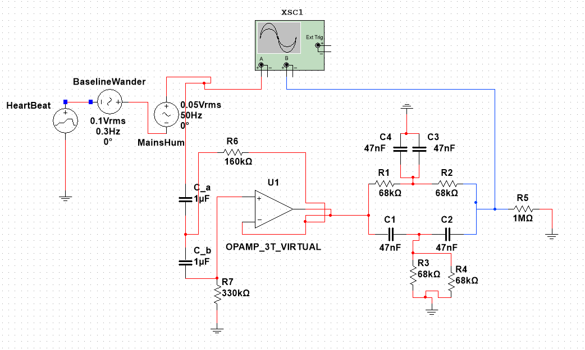
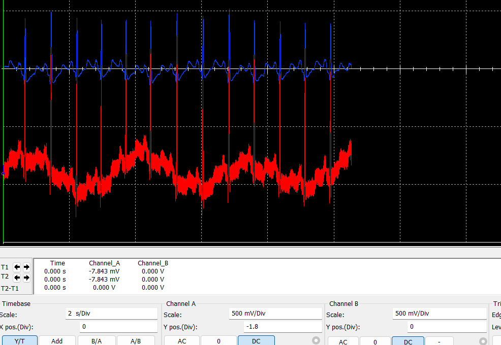
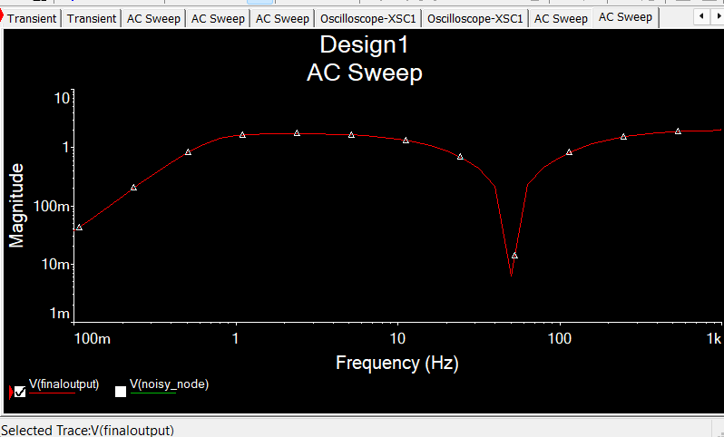

# ECG Noise Removal in Multisim

Take a **real ECG recording**, bury it in realistic noise inside Multisim, and recover the heartbeat with a filter chain.

This repository holds **Design 1**: an active high-pass stage followed by a *passive* twin-T notch filter. A report with the full write-up is in [`report/`](report/ecg_filter_design1.pdf).



## What the circuit does

| Part | What it is | Job |
|---|---|---|
| **HeartBeat** | PWL voltage source fed from a real ECG (MIT-BIH record 100, lead MLII) | The signal we want to recover |
| **BaselineWander** | 0.1 Vrms, 0.3 Hz AC source in series | Imitates drift from breathing and movement |
| **MainsHum** | 0.05 Vrms, 50 Hz AC source in series | Imitates mains pick-up (50 Hz in India) |
| **Stage 1** | Sallen-Key high-pass, 2nd order, C = 1 µF, R6 = 160 kΩ, R7 = 330 kΩ, fc ≈ 0.69 Hz, Q ≈ 0.72 | Removes the baseline wander |
| **Stage 2** | Passive twin-T notch, R = 68 kΩ, C = 47 nF, f0 ≈ 49.8 Hz | Removes the 50 Hz hum |
| **R5** | 1 MΩ to ground | Light load on the output |

The three source voltages add because the sources are wired **in series**. The noisy signal then goes through Stage 1 and Stage 2.

**Why this order?** The Sallen-Key output is a low-impedance source, so it can drive the twin-T directly without loading it. That removes the need for a separate buffer, so the whole design needs only one op-amp.

## Results



In the noisy input the heartbeat is almost buried under the slow wander and the thick 50 Hz band. In the output the baseline is flat, the hum is gone, and the R-peaks and the smaller P and T waves are clearly visible.



AC sweep readings, relative to the 1 Hz reading (1.602 V):

| Frequency | Meaning | Output | Relative gain |
|---|---|---|---|
| 0.3 Hz | baseline wander | 0.326 V | −13.8 dB |
| 1 Hz | reference | 1.602 V | 0 dB |
| 40 Hz | top of the ECG band | 0.201 V | −18.0 dB |
| 49.5 Hz | mains hum | 0.0075 V | −46.6 dB |

### Known limitation: R-peaks are about half their original height

A passive twin-T has a very wide notch (Q ≈ 0.25), so it also attenuates the frequencies below 50 Hz that make up the sharp QRS spike (roughly −2 dB at 10 Hz, −9 dB at 25 Hz, −19 dB at 40 Hz).

- A Python model of the same two filters, run on the clean ECG segment, predicts an R-peak ratio of about **0.51** (the high-pass alone keeps about 0.94).
- In the Multisim transient, the output R-peaks reach roughly 0.45 to 0.5 V against about 1 V for the source, which agrees.
- The P and T waves are slow and are barely affected, so the *proportions* of the waveform change even though the beats are easy to see and count.

For finding beats and reading heart rate this is good enough. It is not a faithful copy of the original waveform shape.

## Reproduce it

1. **Get the data.** Download record `100.csv` from the Kaggle dataset *MIT-BIH Arrhythmia Database (Simple CSVs)* (360 samples per second, columns `MLII` and `V5`). Do not use the `*annotations.txt` files: they are beat labels, not the signal.
2. **Make the PWL file** (or use the ready-made [`data/ecg100_pwl.txt`](data/ecg100_pwl.txt)):
   ```bash
   pip install numpy pandas
   python scripts/make_pwl.py path/to/100.csv data/ecg100_pwl.txt
   ```
   This converts ADC counts to millivolts with `(count − 1024) / 200`, cuts a clean 10 s window starting at 318 s, removes the offset, scales the peak to 1 V and writes `time voltage` pairs.
3. **Build the circuit** in Multisim as in the schematic above. Point the HeartBeat PWL source at the data file (the exact menu wording varies by Multisim version).
4. **Run a Transient analysis:** End time `10 s`, maximum time step `0.0003 s`. Judge the output after about 2 s, because the 1 µF capacitors need time to settle.
5. **Run an AC Sweep** (0.1 Hz to 1 kHz, decibel scale). Set the AC analysis magnitude of **one** source to a known value and the others to 0, or plot `db(V(out)/V(in))` so the input level cancels.

### Pitfalls we hit

- **Source wiring:** the three sources must be in series (+ of one to − of the next), not in parallel.
- **Silent disconnections:** a wire that ends next to a pin without a red dot is not connected. If a node reads flat or tiny, run the netlist check and redraw the wire pin to pin. A missing ground pin once crushed the whole signal to microvolts.
- **Virtual op-amp:** look under the Analog virtual components if a search for `OPAMP` returns nothing, or use a real op-amp with ±12 V supplies.

## Repository layout

```
.
├── README.md
├── data/ecg100_pwl.txt          10 s ECG segment as a Multisim PWL file
├── scripts/make_pwl.py          builds the PWL file from the Kaggle CSV
├── multisim/                    put your .ms circuit file(s) here
└── report/
    ├── ecg_filter_design1.tex   LaTeX source
    ├── ecg_filter_design1.pdf   compiled report
    └── figures/                 schematic, transient and sweep screenshots
```

The Multisim circuit file itself is not included yet. Add it to `multisim/`.

## Next steps

- **Design 2 (planned):** replace the passive twin-T with an active one (R/2 and 2C arms driven from a buffered fraction of the output) to narrow the notch and protect the 20 to 45 Hz region. The target is an R-peak ratio near 0.94 with the hum still well suppressed.
- **Heart-rate range:** a slow heart (40 bpm is about 0.67 Hz) sits right at the 0.69 Hz high-pass corner. Covering low heart rates means lowering the corner to about 0.3 to 0.5 Hz, which narrows the margin against the 0.3 Hz wander.
- Add motion artifact and muscle noise to better represent a wearable device.

## Data source and citation

ECG data from the MIT-BIH Arrhythmia Database on PhysioNet. Please cite:

Moody GB, Mark RG. The impact of the MIT-BIH Arrhythmia Database. *IEEE Eng in Med and Biol* 20(3):45-50 (May-June 2001), together with the standard PhysioNet citation (Goldberger et al., *Circulation* 101(23):e215-e220, 2000).
